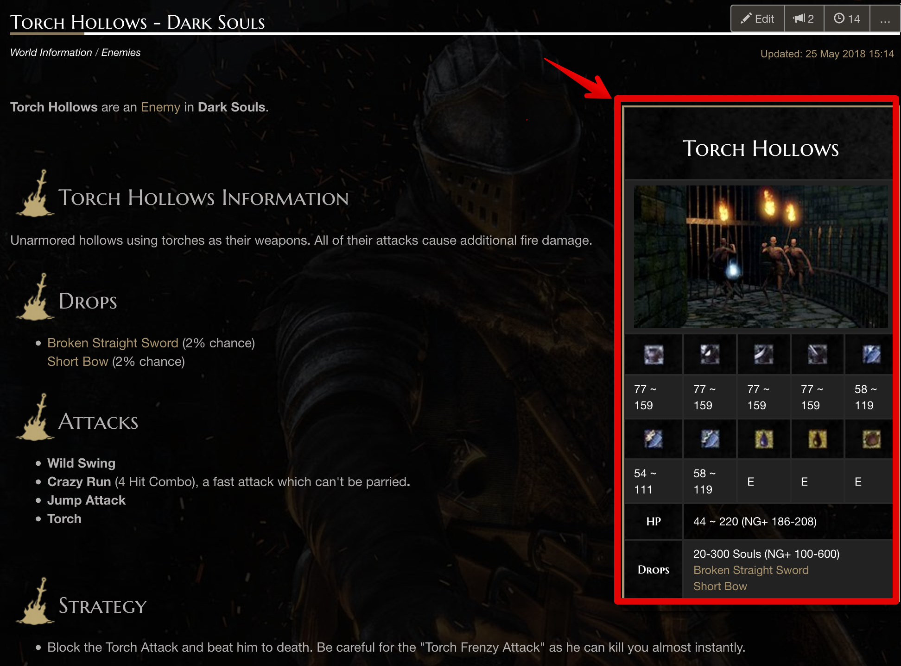
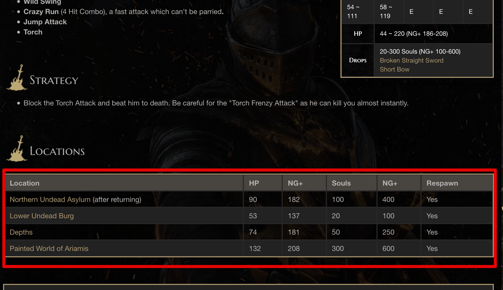

# &#9678; WebScraping Project - Dark Souls Enemies

**In this project we are going to retrieve data from [Dark Souls Remastered Wiki Page](https://darksouls.wiki.fextralife.com/Dark+Souls+Wiki), particularly from the [Enemies' Section](https://darksouls.wiki.fextralife.com/Enemies). We are going to be taking each enemie's name, stats (HP, Physical Defense, Slash Defense, Poison Resistance, Bleed Resistance, etc..), as well as the multiple variations of each one in order to create a DataFrame containing all this info.! **

**Let's begin by taking an example of a single enemy**

url = 'https://darksouls.wiki.fextralife.com/Torch+Hollows'

html = requests.get(url)

**Creating our BeautifulSoup object: **

bs_obj = BeautifulSoup(html.text, "lxml")

**Now that we've got the raw html of the [Torch Hollows Enemy Page](https://darksouls.wiki.fextralife.com/Torch+Hollows) we can start locating where our desired information resides in it. Inside the page, we can see on the right side a box containing some information that we need from the enemy: their defenses and immunities.**

**However, if we scroll down to the 'Locations' section, we see multiple variations of the character, depending on what point (location) of the game you encounter it, each version has its own HP and Souls associated to it.** 

 **In order to go around this, the solution is to create two separate tables: the first being the <u>Enemy</u> table, which will contain only a single record for each character with the respective information about Defenses and immunites. The primary key will be the name of the enemy itself, since there will be no redundancy in this dataframe. The second table will provide us with different variations of the enemies, the name of the character will be a Foreign Key in this case, since there will be redundancy. At the end, we will be able to join both tables into a <u>single</u> frame **
 
 # Let's get to it!
 
 **"Chosen Undead. Your fate is… to succeed the Great Lord Gwyn. So that you may link the Fire, cast away the Dark, and undo the curse of the Undead."**
